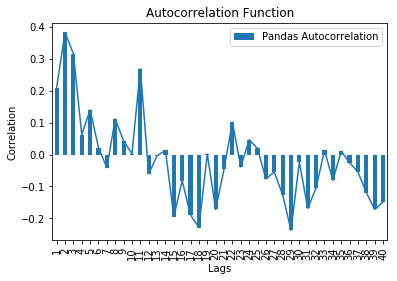
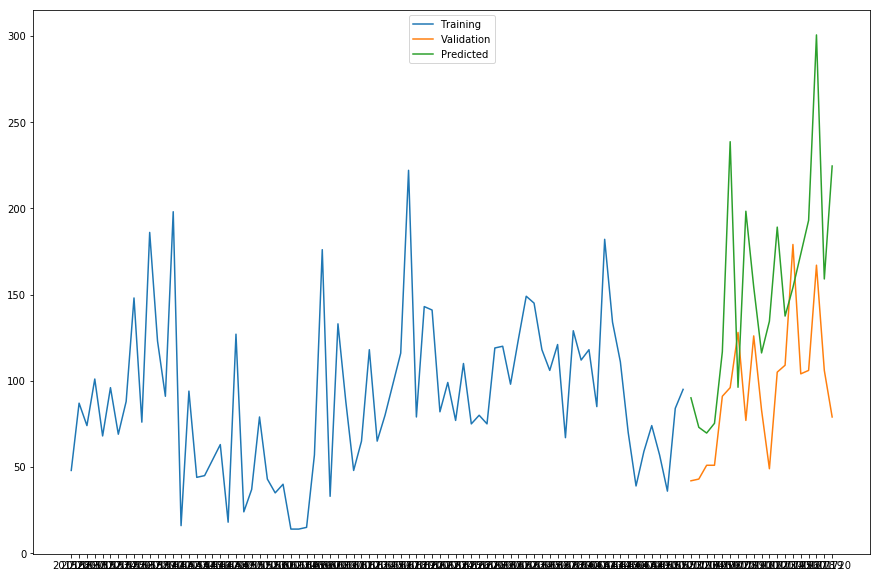
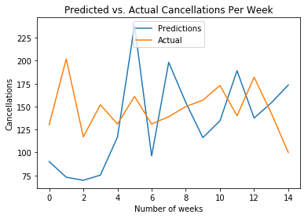
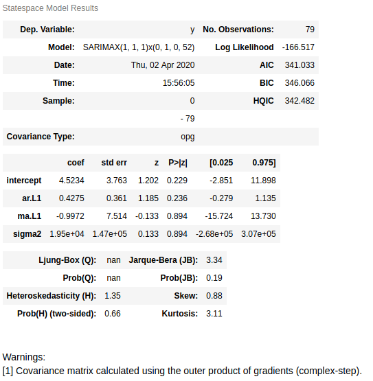
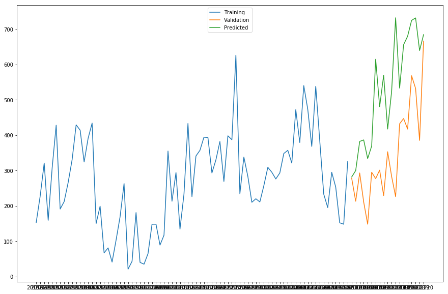
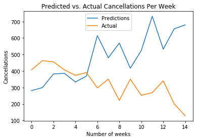

[Home](https://mgcodesandstats.github.io/) |
[Medium](https://medium.com/@firstclassanalyticsmg) |
[LinkedIn](https://www.linkedin.com/in/michaeljgrogan/) |
[GitHub](https://github.com/mgcodesandstats) |
[Speaking Engagements](https://mgcodesandstats.github.io/speaking-engagements/) |
[Terms](https://mgcodesandstats.github.io/terms/) |
[E-mail](mailto:contact@michael-grogan.com)

# Predicting Weekly Hotel Cancellations with ARIMA

Hotel cancellations can cause issues for many businesses in the industry. Not only is there the lost revenue as a result of the customer cancelling, but this can also cause difficulty in coordinating bookings and adjusting revenue management practices.

Data analytics can help to solve this issue, in terms of identifying the customers who are most likely to cancel – allowing a hotel chain to adjust its marketing strategy accordingly.

An ARIMA model is used to determine whether hotel cancellations can also be predicted in advance. This will be done using the Algarve Hotel dataset in the first instance (H1full.csv). Since we are now seeking to predict the time series trend, all observations are now included in this dataset (cancellations and non-cancellations, irrespective of whether the dataset as a whole is uneven).

To do this, cancellations are analysed on a weekly basis (i.e. the number of cancellations for a given week are summed up).

Firstly, data manipulation procedures were carried out using pandas to sum up the number of cancellations per week and order them correctly.

In configuring the ARIMA model, the first 80 observations are used as **training data**, with the following 20 then used as **validation data**.

Once the model has been configured, the last 15 observations are then used as **test data** to gauge the model accuracy on unseen data.

Here is a snippet of the output:


The time series is visualised, and the autocorrelation and partial autocorrelation plots are generated:

**Time Series**


**Autocorrelation**



**Partial Autocorrelation**


```
#Dickey-Fuller Test
result = ts.adfuller(train)
result
print('ADF Statistic: %f' % result[0])
print('p-value: %f' % result[1])
print('Critical Values:')
for key, value in result[4].items():
    print('\t%s: %.3f' % (key, value))
```

When a Dickey-Fuller test is run, a p-value of less than 0.05 is generated, indicating that the null hypothesis of non-stationarity is rejected (i.e. the data is stationary).

```
ADF Statistic: -2.677149
p-value: 0.078077
Critical Values:
	1%: -3.519
	5%: -2.900
	10%: -2.587
```

An ARIMA model is then run using auto_arima from the **pyramid** library. This is used to select the optimal (p,d,q) coordinates for the ARIMA model.

```
from pyramid.arima import auto_arima
Arima_model=auto_arima(train, start_p=0, start_q=0, max_p=10, max_q=10, start_P=0, start_Q=0, max_P=10, max_Q=10, m=52, seasonal=True, trace=True, d=1, D=1, error_action='warn', suppress_warnings=True, random_state = 20, n_fits=30)
```

The following output is generated:

```
Fit ARIMA: order=(0, 1, 0) seasonal_order=(0, 1, 0, 52); AIC=305.146, BIC=307.662, Fit time=0.382 seconds
Fit ARIMA: order=(1, 1, 0) seasonal_order=(1, 1, 0, 52); AIC=nan, BIC=nan, Fit time=nan seconds
Fit ARIMA: order=(0, 1, 1) seasonal_order=(0, 1, 1, 52); AIC=nan, BIC=nan, Fit time=nan seconds
Fit ARIMA: order=(0, 1, 0) seasonal_order=(1, 1, 0, 52); AIC=nan, BIC=nan, Fit time=nan seconds
Fit ARIMA: order=(0, 1, 0) seasonal_order=(0, 1, 1, 52); AIC=nan, BIC=nan, Fit time=nan seconds
Fit ARIMA: order=(0, 1, 0) seasonal_order=(1, 1, 1, 52); AIC=nan, BIC=nan, Fit time=nan seconds
Fit ARIMA: order=(1, 1, 0) seasonal_order=(0, 1, 0, 52); AIC=292.219, BIC=295.993, Fit time=2.065 seconds
Fit ARIMA: order=(1, 1, 1) seasonal_order=(0, 1, 0, 52); AIC=293.486, BIC=298.518, Fit time=2.021 seconds
Fit ARIMA: order=(2, 1, 1) seasonal_order=(0, 1, 0, 52); AIC=294.780, BIC=301.070, Fit time=3.745 seconds
Fit ARIMA: order=(1, 1, 0) seasonal_order=(0, 1, 1, 52); AIC=nan, BIC=nan, Fit time=nan seconds
Fit ARIMA: order=(1, 1, 0) seasonal_order=(1, 1, 1, 52); AIC=nan, BIC=nan, Fit time=nan seconds
Fit ARIMA: order=(2, 1, 0) seasonal_order=(0, 1, 0, 52); AIC=293.144, BIC=298.176, Fit time=1.924 seconds
Total fit time: 10.167 seconds
```

Based on the lowest AIC, the **SARIMAX(1, 1, 0)x(0, 1, 0, 52)** configuration is identified as the most optimal for modelling the time series.

Here is the output of the model:


With **90%** of the series used as the training data to build the ARIMA model, the remaining **10%** is now used to test the predictions of the model. Here are the predictions vs the actual data:



We can see that while the prediction values were lower than the actual test values, the direction of the two series seem to be following each other.

From a business standpoint, a hotel is likely more interested in predicting whether the degree of cancellations will increase/decrease in a particular week - as opposed to the precise number of cancellations - which will no doubt be more subject to error and influenced by extraneous factors.

In this regard, the [mean directional accuracy](https://gist.github.com/bshishov/5dc237f59f019b26145648e2124ca1c9) is used to determine the degree to which the model accurately forecasts the directional changes in cancellation frequency from week to week.

```
def mda(actual: np.ndarray, predicted: np.ndarray):
    """ Mean Directional Accuracy """
    return np.mean((np.sign(actual[1:] - actual[:-1]) == np.sign(predicted[1:] - predicted[:-1])).astype(int))
```

An MDA of 89% is yielded:

```
>>> mda(val, predictions)

0.8947368421052632
```

In this regard, the ARIMA model has shown a reasonably high degree of accuracy in predicting directional changes for hotel cancellations across the test set.

The RMSE (root mean square error) is also predicted:

```
>>> import math
>>> from sklearn.metrics import mean_squared_error

>>> mse = mean_squared_error(val, predictions)
>>> rmse = math.sqrt(mse)
>>> print('RMSE: %f' % rmse)

RMSE: 77.047253
```

The RMSE stands at 77 in this case. Note that the units of RMSE are the same as the response variable, in this case - hotel cancellations. With an average cancellation of 94 for all weeks across the validation data, the RMSE of 77 is technically the standard deviation of the unexplained variance. All else being equal, the lower this value, the better.

## Testing against unseen data

Even though the ARIMA model has been trained and the accuracy validated across the validation data, it is still unclear how the model would perform against unseen data (or test data).

In this regard, the ARIMA model is used to generate predictions for n=15 using the test.index to specify the unseen data.

```
>>> test = np.array([[130,202,117,152,131,161,131,139,150,157,173,140,182,143,100]])
```

Firstly, the array is reshaped accordingly:

```
>>> test=test.reshape(-1)
>>> test

array([130, 202, 117, 152, 131, 161, 131, 139, 150, 157, 173, 140, 182,
       143, 100])
```

Now, the predictions are made, and the RMSE (root mean squared error), MDA (mean directional accuracy) and mean forecast errors are calculated:

```
>>> predictionnew=pd.DataFrame(Arima_model.predict(n_periods=15), index=test.index)
>>> predictionnew.columns = ['Unseen_Predicted_Cancellations']
>>> predictionsnew=predictionnew['Unseen_Predicted_Cancellations']

>>> mse_new = mean_squared_error(test, predictionsnew)
>>> rmse_new = math.sqrt(mse_new)
>>> print('RMSE: %f' % rmse_new)

RMSE: 57.955865

>>> mda(test, predictionsnew)

0.8666666666666667

>>> forecast_error_new = (predictionsnew-test)
>>> forecast_error_new

0     -39.903941
1    -128.986739
2     -47.325146
3     -76.683169
4     -14.237713
5      77.591519
6     -34.782635
7      59.277972
8       4.404317
9     -40.860982
10    -38.522419
11     49.074094
12    -44.497360
13     11.040560
14     73.507259
dtype: float64

>>> mean_forecast_error_new = np.mean(forecast_error_new)
>>> mean_forecast_error_new

-12.726958780163237
```

The RMSE has improved slightly (dropped to 57), while the MDA has dropped to 86% and the mean forecast error stands at -12, meaning that the model has a tendency to slightly underestimate the cancellations and therefore the forecast bias is negative.

Here is a plot of the predicted vs actual cancellations:



## ARIMA Modelling on H2 Data

The same procedures were applied - this time using the second dataset.

The following is the ARIMA configuration obtained using pyramid-arima:



**Predicted vs. Validation**



**Predicted vs. Actual**



- **RMSE on test data:** 274
- **Mean Directional Accuracy:** 0.8666
- **Mean Forecast Error:** 156.332

# Conclusion

In this example, the ARIMA model was used to predict the degree of hotel cancellations on a week-by-week basis. The MDA demonstrated 86% accuracy in doing so across the test set with an RMSE of 57 on the H1 dataset, and an 86% MDA was yielded once again for the H2 dataset with an RMSE of 274 (with the mean cancellations across the 15 weeks in the test set coming in at 327).

Of course, a limitation of these findings is that both hotels under study are based in Portugal. Testing the model across hotels in other countries would help to validate the accuracy of this model further.

The datasets and notebooks for this example are available at the [MGCodesandStats GitHub repository](https://github.com/MGCodesandStats/hotel-modelling), along with further research on this topic.
