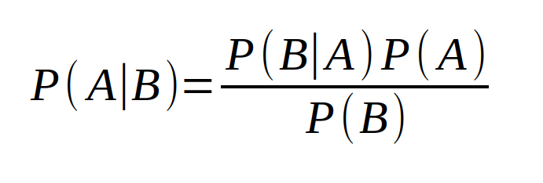
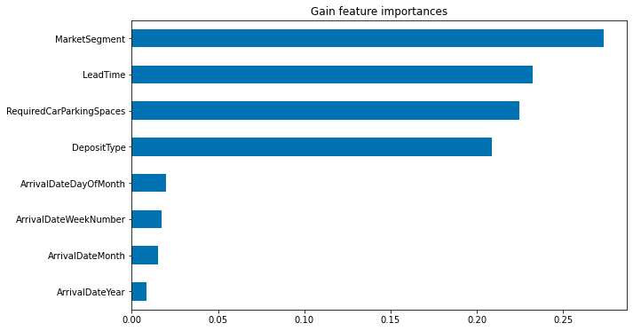

[Home](https://mgcodesandstats.github.io/) |
[GitHub](https://github.com/mgcodesandstats) |
[Speaking Engagements](https://mgcodesandstats.github.io/speaking-engagements/) |
[Terms](https://mgcodesandstats.github.io/terms/) |
[E-mail](mailto:contact@michael-grogan.com)

# Building a Naive Bayes Classifier: Predicting Hotel Cancellations

In this example, a Naive Bayes classifier is built in order to predict customers that are likely to cancel their hotel booking.

## What Is a Naive Bayes Classifier?

A Naive Bayes Classifier is a probabilistic classifier, and one of the most fundamental classification models. The reason we refer to the classifier as a "naive" one is because this classifier *naively* assumes that all features in the dataset are independent of each other, i.e. conditional independence.

From this standpoint, feature selection is not typically a strength of the Naive Bayes Classifier. Given the assumption that all features are independent of each other, this classifier is at risk of performing poorly when significant correlation exists between the features.

Bayes' Theorem  is defined as follows:



This theorem works on the basis of **conditional probability**, i.e. the probability of an outcome occurring given the occurrence of a previous outcome. In this instance, the probabilities of a particular event occurring are updated as new information is gathered.

For this particular scenario, we are looking to answer - what is the probability that a customer will cancel their hotel booking given prior probabilities?

In this case, the Gaussian Naive Bayes algorithm for classification is applied. Even though the outcome variable is categorical (1 = cancellation, 0 = no cancellation), many of the features included in the model are continuous. Therefore, it is assumed that these continuous features are distributed according to a normal (Gaussian) distribution.

## Data Manipulation

In this regard, feature selection will not be conducted prior to running the Naive Bayes model. The model is built using the following features:

1. leadtime
2. arrivaldateyear
3. arrivaldateweekno
4. arrivaldatedayofmonth
5. staysweekendnights
6. staysweeknights
7. adults
8. babies
9. isrepeatedguest
10. previouscancellations
11. previousbookingsnotcanceled
12. bookingchanges
13. dayswaitinglist
14. adr
15. rcps
16. totalsqr
17. arrivaldatemonth
18. meal
19. country
20. marketsegment
21. distributionchannel
22. reservedroomtype
23. assignedroomtype
24. deposittype
25. customertype

The interval (or continuous random variables) are defined. As two examples:

```
leadtime = train_df['LeadTime']
adr = train_df['ADR']
```

Variables with a categorical component are defined using '''cat.codes'''.

As two further examples:

```
deposittypecat=train_df.DepositType.astype("category").cat.codes
deposittypecat=pd.Series(deposittypecat)
customertypecat=train_df.CustomerType.astype("category").cat.codes
customertypecat=pd.Series(customertypecat)
```

A numpy column stack is formulated for the independent variables (both continuous and categorical):

```
x1 = np.column_stack((leadtime,arrivaldateyear,arrivaldateweekno,arrivaldatedayofmonth,staysweekendnights,staysweeknights,adults,babies,isrepeatedguestcat,previouscancellations,previousbookingsnotcanceled,bookingchanges,dayswaitinglist,adr,rcps,totalsqr,arrivaldatemonthcat,mealcat,countrycat,marketsegmentcat,distributionchannelcat,reservedroomtypecat,assignedroomtypecat,deposittypecat,customertypecat))
x1 = sm.add_constant(x1, prepend=True)
```

The data is then split into training and validation sets:

```
X_train, X_val, y_train, y_val = train_test_split(x1, y1)
```

## Precision vs. Recall and f1-score

Before we run the model, let's talk a little bit about **precision** versus **recall**.

When comparing the accuracy scores, we see that numerous readings are provided in each confusion matrix.

```
Precision = ((True Positive)/(True Positive + False Positive))

Recall = ((True Positive)/(True Positive + False Negative))
```

The two readings are often at odds with each other, i.e. it is often not possible to increase precision without reducing recall, and vice versa.

An assessment as to the ideal metric to use depends in large part on the specific data under analysis. For example, cancer detection screenings that have false negatives (i.e. indicating patients do not have cancer when in fact they do), is a big no-no. Under this scenario, recall is the ideal metric.

However, for emails - one might prefer to avoid false positives, i.e. sending an important email to the spam folder when in fact it is legitimate.

The f1-score takes both precision and recall into account when devising a more general score.

Which would be more important for predicting hotel cancellations?

Well, from the point of view of a hotel - they would likely wish to identify customers who are ultimately going to cancel their booking with greater accuracy - this allows the hotel to better allocate rooms and resources. Identifying customers who are not going to cancel their bookings may not necessarily add value to the hotel's analysis, as the hotel knows that a significant proportion of customers will ultimately follow through with their bookings in any case.

## Model Configuration and Results

The relevant features as outlined above are included for determining whether the customer will cancel their booking.

The GaussianNB library is imported from scikit-learn:

```
from sklearn.naive_bayes import GaussianNB
```

The Gaussian Naive Bayes model is defined:

```
>>> gnb = GaussianNB()
>>> gnb

GaussianNB(priors=None, var_smoothing=1e-09)
```

Predictions are generated on the validation set:

```
>>> y_pred = gnb.fit(x1_train, y1_train).predict(x1_val)
>>> y_pred

array([1, 1, 0, ..., 0, 1, 1])
```

A confusion matrix is generated comparing the predictions with the actual results from the validation set:

```
>>> from sklearn.metrics import classification_report,confusion_matrix
>>> print(confusion_matrix(y1_val,y_pred))
>>> print(classification_report(y1_val,y_pred))

[[2842 4424]
 [ 165 2584]]
              precision    recall  f1-score   support

           0       0.95      0.39      0.55      7266
           1       0.37      0.94      0.53      2749

    accuracy                           0.54     10015
   macro avg       0.66      0.67      0.54     10015
weighted avg       0.79      0.54      0.55     10015
```

Recall for class 1 comes in at **94%**, while the f1-score accuracy comes in at **54%**. Now, let's test the prediction performance on H2 (the test set).

```
[[ 7863 38365]
 [ 2722 30380]]
              precision    recall  f1-score   support

           0       0.74      0.17      0.28     46228
           1       0.44      0.92      0.60     33102

    accuracy                           0.48     79330
   macro avg       0.59      0.54      0.44     79330
weighted avg       0.62      0.48      0.41     79330
```

We see that recall for class 1 is down slightly to **92%**, while f1-score accuracy comes in at **48%**.

Clearly, there is a trade-off between higher recall and overall higher accuracy. Given that most entries in the dataset are 0 (non-cancellations), it stands to reason that a model with an overall high accuracy rate would perform quite well in predicting the non-cancellations, but poorly at predicting the 1 entries (cancellations).

For instance, when an SVM was run on this dataset, the following results were obtained:

```
[[25217 21011]
 [ 8436 24666]]
              precision    recall  f1-score   support

           0       0.75      0.55      0.63     46228
           1       0.54      0.75      0.63     33102

    accuracy                           0.63     79330
   macro avg       0.64      0.65      0.63     79330
weighted avg       0.66      0.63      0.63     79330
```

We see that the f1-score accuracy is up to 63%, but recall for class 1 has fallen to 75%.

In this regard, if one wished to prioritise identification of cancellations as opposed to maximising overall accuracy, then the argument could be made that the Naive Bayes model works better in this instance. However, it should be remembered that maximising recall only works to a certain point. If recall was 100%, then all bookings could be classified as a cancellation, and this does not reveal any insights regarding the differences between customers who cancel and those who do not.

## Limitations

As mentioned, Naive Bayes regards all features as independent. In this regard, the model risks poor performance in situations where there is strong conditional dependence among the variables, e.g. let us say that more cancellations are observed across customers from a particular country of origin. However, we also observe that those cancellations are much higher across a particular market segment.

In this regard, given the conditional dependence between these two features, we can no longer be certain that cancellations are higher for customers from a particular country of origin, as it could just so happen that a higher number of customers from a particular market segment are present for bookings from that particular country.

Feature selection is an important part of machine learning - indeed, there are many models that are capable of explaining which features contribute more to influencing the outcome variable, as in the example below.



However, Naive Bayes assumes all features are essentially weighted equally, and this can significantly affect accuracy readings depending on the data.

## Conclusion

In this example, we have seen how a Naive Bayes model can be constructed in Python and how model accuracy can be assessed using precision and recall.

The datasets and notebooks for this example are available at the [MGCodesandStats GitHub repository](https://github.com/MGCodesandStats/hotel-modelling), along with further research on this topic.

## References

- [Antonio, Almeida, and Nunes, 2016: Using Data Science to Predict Hotel Booking Cancellations](https://www.researchgate.net/publication/309379684_Using_Data_Science_to_Predict_Hotel_Booking_Cancellations)

- [DZone: Naive Bayes Tutorial: Naive Bayes Classifier in Python](https://dzone.com/articles/naive-bayes-tutorial-naive-bayes-classifier-in-pyt)

- [Gunopulos and Ratanamahatana, 2003: Feature Selection for the Naive Bayesian Classifier Using Decision Trees](https://www.researchgate.net/publication/220355799_Feature_Selection_for_the_Naive_Bayesian_Classifier_Using_Decision_Trees)

- [Imbalanced Classes: Predicting Hotel Cancellations with Support Vector Machines](https://towardsdatascience.com/svms-random-forests-and-unbalanced-datasets-predicting-hotel-cancellations-2b983c2c5731)

- [Jupyter Notebook Output](https://github.com/MGCodesandStats/hotel-modelling/tree/master/notebooks%20and%20datasets/classification)

- [Scikit-Learn Guide](https://scikit-learn.org/stable/modules/naive_bayes.html)

- [When Dependence Between Events Is Conditional](https://www.probabilisticworld.com/conditional-dependence-independence/)