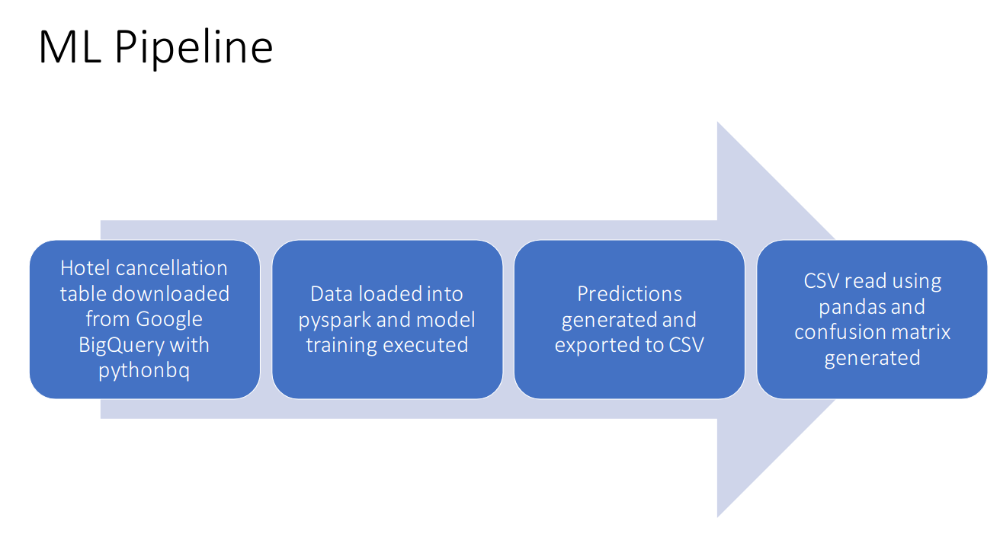
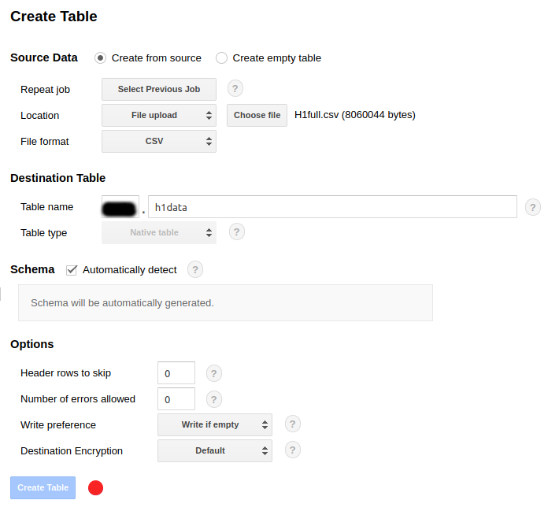

[Home](https://mgcodesandstats.github.io/) |
[GitHub](https://github.com/mgcodesandstats) |
[Speaking Engagements](https://mgcodesandstats.github.io/speaking-engagements/) |
[Terms](https://mgcodesandstats.github.io/terms/) |
[E-mail](mailto:contact@michael-grogan.com)

# Productionising ML Projects with Google BigQuery and Pyspark: Predicting Hotel Cancellations

All too often, data scientists get caught up in the exploratory phase of data science – i.e. running multiple models on a particular dataset and optimising for accuracy.

However, there is always the risk of spending too much time on this phase and not enough on production. That is to say, collating data from multiple sources and making sure that the infrastructure is suitable for working with large data streams.

Here is an example of an ML pipeline built for predicting hotel cancellations with a Gradient Boosting Classifier. Two models for two different hotels (H1 and H2) are built and run in this example.

## Pipeline

Specifically, the pipeline is set up as follows:

1. The hotel cancellation table is downloaded from a Google BigQuery database into a Jupyter Notebook with pythonbq – a Python client for BigQuery.

2. A Spark session is initialised using pyspark. The relevant data transformations are conducted to allow the GBTClassifier to work with the relevant data.

3. An 80/20 train-test split is conducted to allow the model to assess performance on an unseen portion of the training set.

4. Model predictions are converted from a Spark to pandas Data Frame, and then exported to CSV. These predictions are then read back into the Jupyter Notebook, and a confusion matrix is generated to assess model accuracy.



## Google BigQuery

Firstly, the relevant CSV file for H1 can be uploaded to a Google BigQuery and stored as a table.



In this case, the “Automatically Detect” option for Schema is selected, and the table is generated.

Here is the table as displayed in Google BigQuery:


## Interaction with Pyspark

Spark is specifically designed for handling “big data”. While the size of the datasets in this example are still of a suitable size to be run with models inherent to Python itself, one assumes that as more data is added to the database, it will eventually be necessary to use Spark in order to efficiently process these big data batches. Moreover, Spark is better suited to working with data that is being streamed and updated constantly.

A Spark session is initialised with pyspark, and pythonbq is used to load data from BigQuery:

```
import pyspark
conf = pyspark.SparkConf()

conf.set('spark.local.dir', 'path')
sc = pyspark.SparkContext(conf=conf)

from pythonbq import pythonbq

myProject=pythonbq(
  bq_key_path='json_file',
  project_id='project_id'
)
```

Here is a display of the table in Jupyter Notebook:


The relevant features and output label are loaded:

```
from pyspark.ml import Pipeline
from pyspark.ml.feature import OneHotEncoderEstimator, StringIndexer, VectorAssembler
categoricalColumns = ["Country", "MarketSegment", "ArrivalDateMonth", "DepositType", "CustomerType"]

stages = []
for categoricalCol in categoricalColumns:
    stringIndexer = StringIndexer(inputCol=categoricalCol, outputCol=categoricalCol + "Index")
    encoder = OneHotEncoderEstimator(inputCols=[stringIndexer.getOutputCol()], outputCols=[categoricalCol + "classVec"])
    stages += [stringIndexer, encoder]

label_stringIdx = StringIndexer(inputCol="IsCanceled", outputCol="label")
stages += [label_stringIdx]

numericCols = ["LeadTime", "ArrivalDateYear", "ArrivalDateWeekNumber", "ArrivalDateDayOfMonth", "RequiredCarParkingSpaces"]
assemblerInputs = [c + "classVec" for c in categoricalColumns] + numericCols
assembler = VectorAssembler(inputCols=assemblerInputs, outputCol="features")
stages += [assembler]
```

## GBTClassifier

The GBTClassifier (or Gradient Boosting Classifier) can now be loaded for training with the relevant data.

```
from pyspark.ml.classification import GBTClassifier
  
partialPipeline = Pipeline().setStages(stages)
pipelineModel = partialPipeline.fit(dataset)
preppedDataDF = pipelineModel.transform(dataset)

gbtClassifier = GBTClassifier()
trainedModel = gbtClassifier.fit(preppedDataDF)
```

Upon splitting the data 80% training and 20% test, the classifier can be trained.

```
gbtModel = gbtClassifier.fit(trainingData)
predictions = gbtModel.transform(testData)
selected = predictions.select("label", "prediction", "probability")
```

Let’s evaluate the model.

```
from pyspark.ml.evaluation import BinaryClassificationEvaluator
evaluator = BinaryClassificationEvaluator(rawPredictionCol="rawPrediction")
evaluator.evaluate(predictions)
```

The model returns an evaluation of 0.9131.

The predictions can now be converted into a Pandas dataframe and exported to CSV:

```
selected.toPandas().to_csv('h1predictions.csv')
```

Upon importing the predictions once again, here is a confusion matrix with the results.


Overall f1-score accuracy is 84%, while a recall of 66% indicates that the model correctly identifies  66% of customers who cancel their hotel booking.

The same procedure is run for the H2 table – here are the confusion matrix results.


The f1-score accuracy comes in at 94%, while recall comes in at 79%.

## Conclusion

In this example, we have seen:

- How to populate a table in Google BigQuery
- Interact a Jupyter Notebook with a BigQuery database
- Implement a Gradient Boosting Classifier using pyspark.ml

Many thanks for your time - any thoughts or feedback are greatly appreciated!

The relevant GitHub repository for this example can be found [here](https://github.com/MGCodesandStats/hotel-modelling/tree/master/notebooks%20and%20datasets/spark), and you can also find more of my data science content at [michael-grogan.com](https://michael-grogan.com/).