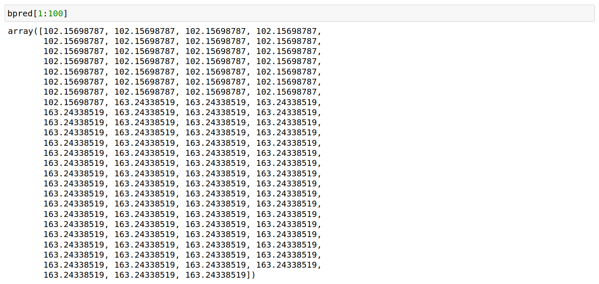
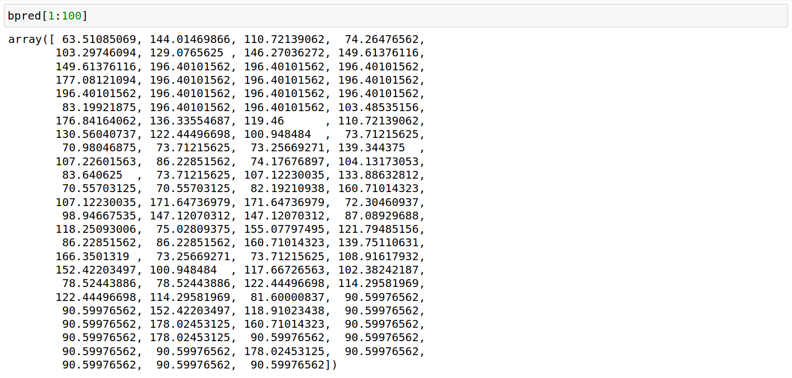
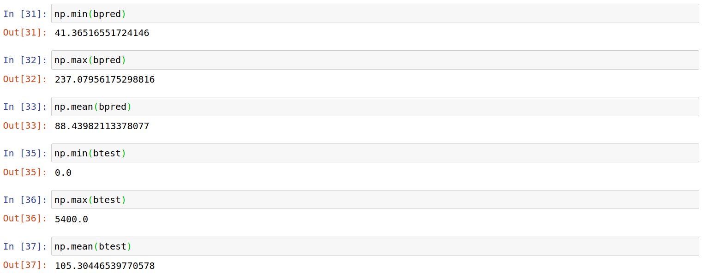
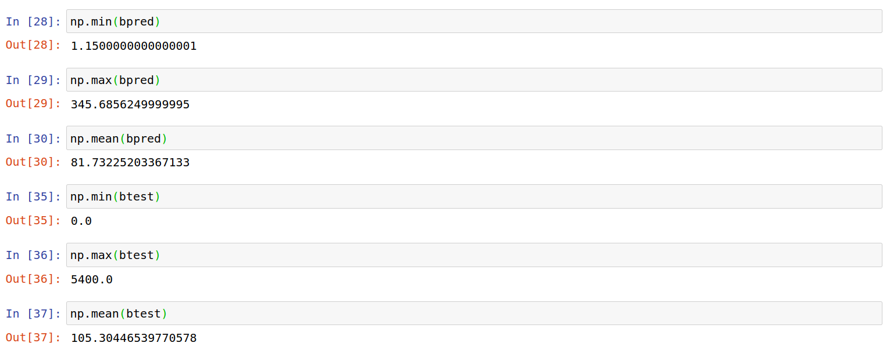

# Are Random Forests Always Better Than Decision Trees?

The commonly accepted argument is that random forests are less prone to overfitting than decision trees, and are therefore a better choice of model. However, is this always the case?

Right off the bat, let's explain what we mean by overfitting using a simple example.

Let us suppose we wish to create a model that predicts the number of ice-creams consumed in New York on a given day in summer.

There are several features of importance that we could choose - one relevant one is temperature. We would expect that as temperatures go up, so do the number of ice-creams consumed.

However, suppose a nonsensical variable is introduced - the number of New Yorkers who wear glasses. On a hot summer day, chances are that more people who wear glasses will consume ice-cream. However, this is not **because** they are wearing glasses - correlation does not imply causation.

That said, introducing this variable will likely cause the "accuracy" of a given model to rise - but this is misleading as it means that the model would not perform well in other scenarios - e.g. when temperatures drop. As such, we can expect such a model to perform well on the training test, but not on a test set (previously unseen data, e.g. ice-cream consumption for New York in the Winter months).

The argument goes that a random forest is less prone to such overfitting, as this model essentially combines the results of many decision trees and outputs the mean prediction - hence why it is often referred to as an **ensemble method**.

However, can we always expect that accuracy across a random forest will be higher than a decision tree? **This highly depends on the features in the model.**

Moreover, accuracy is not the only metric which we should use to judge a model's performance. When it comes to extreme values, averages become meaningless.

Let's look at an example.

## Background

This study focuses on hotel booking analysis. When it comes to hotel bookings, **average daily rate (ADR)** is a particularly important metric. This reflects the average rate per day that a particular customer pays throughout their stay.

This analysis is based on the original study by **Antonio, Almeida, and Nunes, 2016**. The datasets and code are available in the References section below.

Gauging ADR allows hotels to more accurately identify its most profitable customers and tailor its marketing strategies accordingly.

For this example, both a random forest and decision tree algorithm will be used to forecast ADR values across a test set (H2) after modelling on a training set (H1).

## Random Forest

A random forest with **128** decision trees is defined and modelled on the training data:

```
from sklearn.ensemble import RandomForestRegressor
rf = RandomForestRegressor(n_estimators = 128, random_state = 42)
rf.fit(X_train, y_train);
```

Before looking at the results, we can use the random forest to indicate the most important features by rank in our model:

```
# Get numerical feature importances
importances = list(rf.feature_importances_)
importances
```

The top five features in descending order were indicated as **Arrival Date Week Number**, **Arrival Date Month**, **Reserved Room Type**, **Lead Time**, and **Meal**.

Given that there is likely to be a high degree of correlation between *Arrival Date Week Number** and **Arrival Date Month**, the latter feature is dropped from the model.

The predictions on the validation set are generated:

```
>>> predictions_val = rf.predict(X_val)
>>> predictions_val

array([ 51.40799479, 238.87104167,  78.83367472, ...,  67.63143229,
        46.59383677,  64.58239283])
```

The mean absolute error and the root mean squared error is calculated:

```
>>> mean_absolute_error(y_val, predictions_val)
18.265935834058503

>>> mean_squared_error(y_val, predictions_val)
>>> math.sqrt(mean_squared_error(y_val, predictions_val))
29.70493200141034
```

Now, let's calculate how these metrics perform on the test set.

```
>>> mean_absolute_error(btest, bpred)
48.03732623067353

>>> print('mse (sklearn): ', mean_squared_error(btest,bpred))
>>> math.sqrt(mean_squared_error(btest, bpred))
60.58559987303464
```

We see that the errors are quite a bit higher across the test data, which we would expect since the data is unseen.

## Decision Trees

Now, suppose we take the above features and run a regression-based decision tree using a *max_depth* of **4**. What will the results look like then?

```
>>> tree_reg = DecisionTreeRegressor(max_depth=4)
>>> tree_reg.fit(X_train, y_train)

DecisionTreeRegressor(ccp_alpha=0.0, criterion='mse', max_depth=4,
                      max_features=None, max_leaf_nodes=None,
                      min_impurity_decrease=0.0, min_impurity_split=None,
                      min_samples_leaf=1, min_samples_split=2,
                      min_weight_fraction_leaf=0.0, presort='deprecated',
                      random_state=None, splitter='best')
```                      

The predictions are generated:

```
>>> bpred = tree_reg.predict(atest)
>>> bpred

array([102.15698787, 102.15698787, 102.15698787, ..., 163.24338519,
       163.24338519, 163.24338519])
```

Here are the results generated on the test set:

```
>>> mean_absolute_error(btest, bpred)
44.36595492353015

>>> print('mse (sklearn): ', mean_squared_error(btest,bpred))
>>> math.sqrt(mean_squared_error(btest, bpred))
57.28142721449567
```

When comparing the **mean absolute error** and **root mean squared error**, we see that both metrics are actually slightly lower when using decision trees as opposed to using random forests.

With that being said, accuracy is not the only factor that we should take into consideration when building this model - or indeed any model.

Specifically, let's have a look at the types of predictions that each model is generating.

### Decision Tree Output



### Random Forest Output



We can see that the predictions for the decision tree output has a lot less variation than that of the random forest. It would almost appear that the model is generating the same output for data where the parameters of the features are similar. This would mean that while the decision tree model has a strong degree of accuracy on an average basis, the model is more likely to make larger individual errors than the random forest.

Additionally, let's have a look at the data ranges (both predicted and actual) for the two models.

### Ranges: Decision Tree Model



### Ranges: Random Forest Model



We can see that while the mean prediction for the decision tree model (88) is closer to the actual mean ADR value (105), the range of predictions are much narrower than that of the random forest.

In that regard, the decision tree model might show higher accuracy from a mean standpoint, but the individual predictions across the random forest are likely to be superior, especially when forecasting more extreme values.

## Conclusion

Both decision trees and random forests can be used effectively when modelling regression-based data.

However, random forests are more likely to be effective when the model has many features where the importance across each is more balanced. In the case where only a few features are deemed as important, a decision tree may also have high predictive power.

With that being said, we did observe that in this example at least - the random forest was able to account for significantly more variation in the data than the decision tree model - and proved superior in this respect.

From that standpoint, accuracy is not the only factor that should be prioritised when assessing model performance - simply looking at the mean accuracy does not tell the whole story.

Hope you enjoyed this article, and I would be grateful for any feedback or insights!

The datasets and notebooks for this example are available at the [MGCodesandStats GitHub repository](https://github.com/MGCodesandStats/hotel-modelling), along with further research on this topic.

## References

- [Antonio, Almeida, and Nunes, 2016. Using Data Science To Predict Hotel Booking Cancellations](https://www.researchgate.net/publication/309379684_Using_Data_Science_to_Predict_Hotel_Booking_Cancellations)

- [Kaggle: When Would You Prefer A Decision Tree?](https://www.kaggle.com/learn-forum/60582)

- [ML Corner: Linear Regression vs. Decision Trees](https://mlcorner.com/linear-regression-vs-decision-trees/)